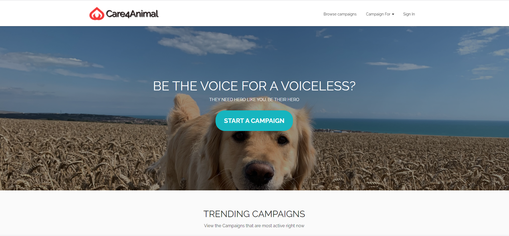

<p align="center">
        
</p>

## Table of contents

- [Introduction](#intro)
- [Technologies](#technologies)
- [Setup](#setup)
- [Features](#features)
- [Screenshots](#screenshots)
- [Contributors](#contributors)
- [Community](#Community)

## Introduction

Care4Animal is a unique crowd funding platform to help animals. You can start a campaign and raise a funds to support your campaign and help the animals.

-Live demo [_here_](https://upbeat-wilson-0d8b2a.netlify.app/).

Frontend and Backend are hosted on Netlify.

## Technologies used to build this project

\
\


## Other Libraries Used

\


## Setup

Requires [Node.js](https://nodejs.org/) to run (v14.15.0+).

Install the dependencies and open the terminal and then run the following command one by one.

```sh
$ git clone https://github.com/pesto-students/n5-care4animal-n5-alpha.git
$ cd n5-care4animal-n5-alpha
$ npm install
$ npm run start
```

Verify by navigating to below address in your preferred browser.

```sh
localhost:[3000] or running port
```

You should be able to see the landing page.

## Features

- PWA developed using React, React-hooks, Redux, Material-Ui and other useful resources mentioned above.
- Fully responsive
- Secured using parse authentication
- Unit test coverage(React Testing Library)
- End-to-End testing using Cypress

## Screenshots



## Resources

<a href="https://drive.google.com/file/d/1Ab8ORPkrZJZ_in82XbpN8cbiblNGpSy3/view?usp=sharing">High Level Design</a>\
<a href="https://drive.google.com/file/d/1wMIJxOPeJjoOq6po2TqHuTcalEfV9ZBT/view?usp=sharing"> PRD </a>\
<a href="https://drive.google.com/file/d/1u_vg7Khu_3Vhy2XMWvcBQwjrSkml8ZFJ/view?usp=sharing"> Wireframes</a>

## Contributors ✨

<a href="https://github.com/iamkishorp">Kishor Patil</a>

## Community

Thanks to the people who directly and indirectly supported me to accomplish this project.
